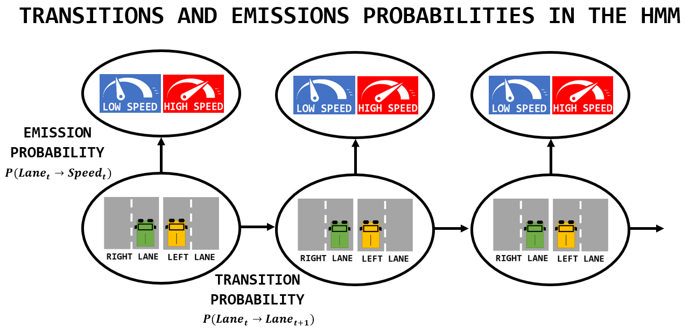
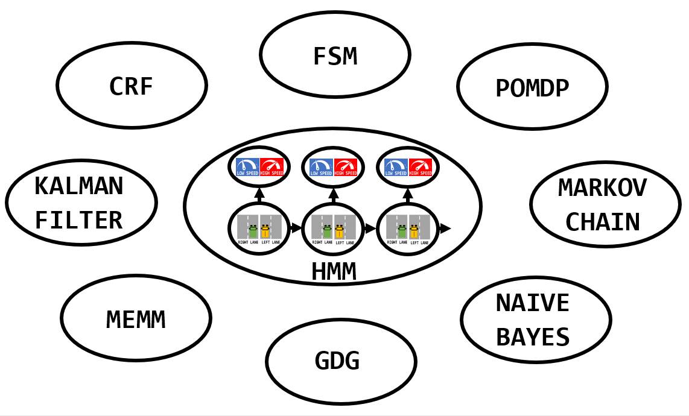
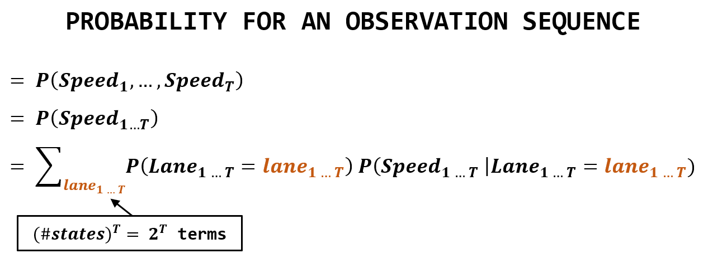
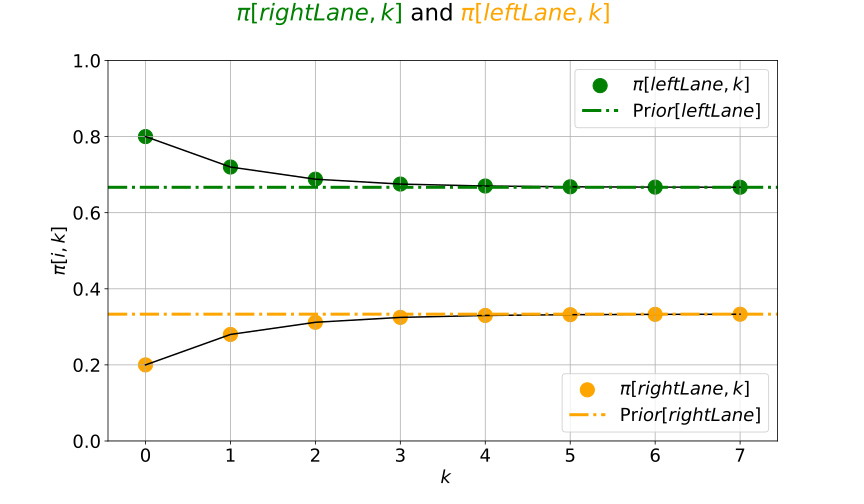
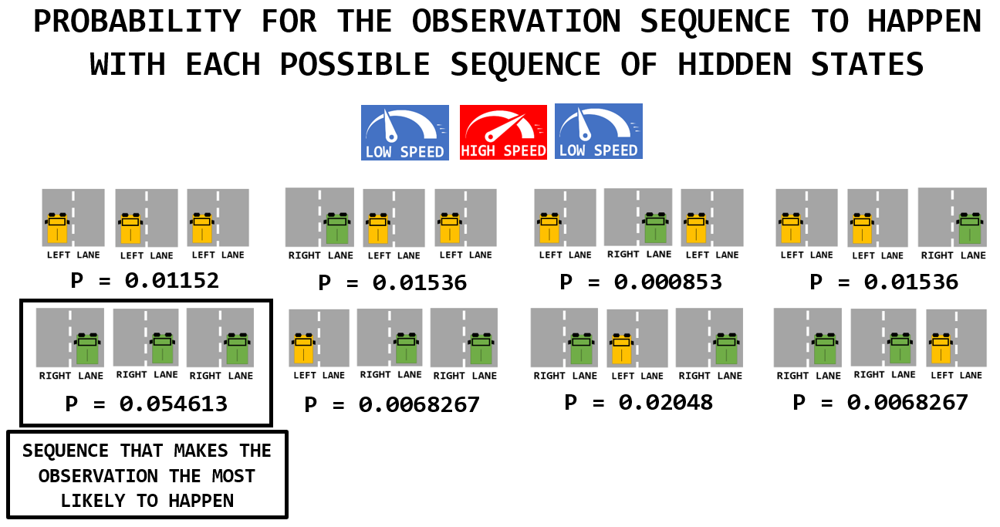
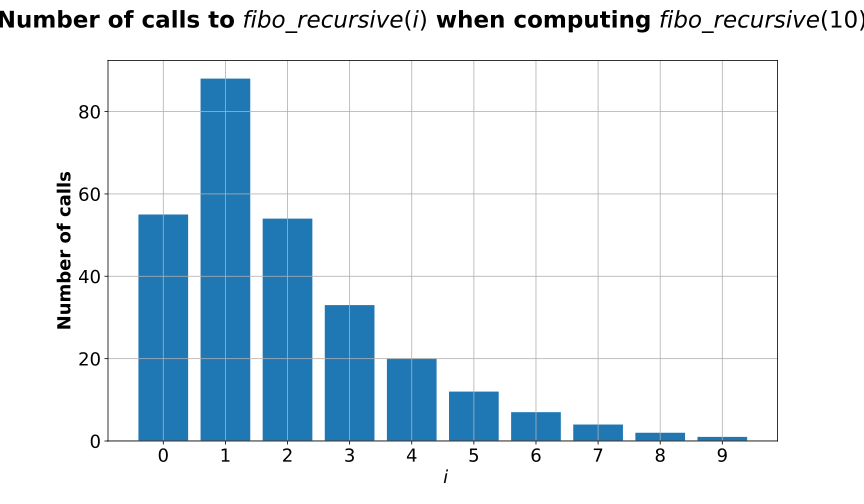

# hmm_for_autonomous_driving

WORK IN PROGRESS!!

to do:
- squash commits
- real traffic data for learning
- include notes about generative model

todo:
- load real highway data from US Department of Transportation 
- https://github.com/hmmlearn/hmmlearn/issues/70
- https://gist.github.com/dougalsutherland/1329976
- https://drive.google.com/file/d/0B51S7y4fFTS2bnNLcnllc1dpdVE/view

Typo:
- capital letters or not
- check links (brocken)

# Introduction
Disclaimer:

- The goal of this repository is to get more familiar with the concepts of **`Hidden Markov Models`** (**= HMM**).
- The scope of ambition is therefore limited and the examples are very simple, only serving educational purposes.

Main topics:
- Problem setting using a basic example to introduce the **HMM terminology**.
- Illustration of the **Bayes' rule** to determine the most likely state given an observation sequence.
- Implementation of the **Forward Algorithm** and the **Backward Algorithm** to compute the probability of a particular observation sequence.
- Definition and illustration of the benefits of **Dynamic Programming**.
- Implementation of the **Viterbi Decoding Algorithm** to find the most likely sequence of hidden states which could have generated a given observation sequence.
- Implementation of the **Baum-Welch Algorithm** to find the most likely parameters (state transition and emission models) of the HMM given an observation sequence.

[Bonus](#Bonus):
- **Literature review** of **HMM implementations** for **Autonomous Driving**.

# Problem motivation
For left-hand-drive countries such as the UK, just invert the reasoning. :smiley:

- Your car is driving on a **2-lane highway**.
- Imagine that you can **remotely monitor the velocity of the car** (e.g. I communicate it to you).
- But you do have **no direct access to the lateral position** (`right lane` of `left lane`).
	- Formally, you **cannot directly observe the underlying stochastic walk between `lane` states**.
- How could you **infer the `lane`** based on the single information you receive (the `speed`)?

### Emission probability

If I am telling you that I am driving with a `low speed`, you **may guess** that I am on the right lane.
- For instance, because I am just driving alone at a reasonable pace.
- Or because I am blocked by a slow vehicle while not able to take it over.
- But I could also drive fast on this `right lane`:
	- Have you ever been driving alone on a non-limited German highway?

Similarly, if you get informed of a `high speed`, you could say that I am **more likely** to be driving on the left lane.
- Probably overtaking another vehicle.
- Nevertheless, this is **not always true**:
	- Think of the situation where you are waiting on the left lane behind a truck trying to overtake another truck.

We get a **first intuition**:
- The variable `lane` seems to have an impact on the variable `speed`.
- In  other words: **you do not drive at the same pace depending if you are one the `left lane` or the `right lane`**.
- But the relation is **not deterministic**, rather **stochastic**.

This **causality finding** will be modelled using **`emission probabilities`** in the following.

### Transition probability

You could have a second intuition about the **sequential process**:
- Human drivers usually **stay on their lanes**.
- Hence, if you are on `right lane` at time `t`, you are likely to still be on `right lane` at time `t+1`.
- Again, this **does not always hold** and you can find **exception**.
- But here comes a second intuition: **the `lane` at time `t` is influenced by the `lane` at time `t-1`**.

The concept of **`transition probability`** will be used to model this second remark.

## Terminology

In the next sections we will see how can we **mathematically support these intuitions**.

|   | 
|:--:| 
| *The `speed` is the `observation` while the `lane` constitutes the `hidden state`. Some examples show that all `emissions` are possible.* |


## Objectives

We can now define three problems which can be solved by an HMM:

- 1- **Learning**
	- The first is **learning the parameters** of its **latent structure** (`emission` model, `transition` model and `initial state` distribution).
	- In the case of a known structure and some **fully observable sampling**, one can apply the concept of **Maximum Likelihood Estimation** (MLE):
		- Some observation sequences (`speed`) and their associated states (`lane`) have been collected. The **samples** form the **training dataset**.
		- Parameters can be selected so as to **maximise the likelihood** for the model to **have produced the data** from the given dataset.
		- Question [Q1](#q1) addresses this method of **supervised learning**.
	- In case it is **not possible to sample from hidden states**, one should go for **unsupervised learning**.
		- A method based on **Expectation Maximization** (EM) is presented in [Q6](#q6).

- 2- **Evaluation**
	- Once the HMM is defined and its parameters are determined, the second task is to find **how likely is it to get a particular observation sequence**.
	- This problem, sometimes called **"Scoring"**, is covered in question [Q3](#q3).

- 3- **Inference**
	- In the third problem, we want to **infer the sequence of lanes** driven by the car ((`right` or `left`) = **hidden state**) based on a **sequence of speed measurements** (= **observation**).
	- Three types of inference can be distinguished:
		- **Filtering**: determine the **latest belief state**, i.e. the posterior distribution P(`lane(t)` | [`speed(1)`, ..., `speed(t)`]). This is detailed in [Q4](#q4).
		- **Decoding**: determine the **full** hidden state **sequence** that gives the **best explanation** for the observation sequence, as explained in [Q5](#q5).
		- **Prediction**: determine the probability for the **future hidden state in `k` steps**, i.e. the posterior conditional distribution P(`lane(t+k)` | [`speed(1)`, ..., `speed(t)`] ). It is mentioned in [Q4](#q4).
		- **Smoothing**: determine the probability for the **past hidden state `k` steps ago**, i.e. the posterior conditional distribution P(`lane(t-k)` | [`speed(1)`, ..., `speed(t)`] ). It is mentioned in [Q4](#q4).
	- Before applying these techniques to sequences, [Q2](#q2) shows how to make inference for **singles observations**.

## Assumptions
To keep the problem as simple as possible:
- Let's **discretize** the `speed` **observation variable** into `low speed` and `high speed`.
- Time steps are also discretized.
- Lane transitions are ignored: either you are on `left lane` or you are on `right lane`.

### Stationary Process

- We assume that the HMM models (transition matrix, emission matrix) stay **constant over time**.
- P[`speed(t)` | `lane(t)`] and P[`lane(t+1)` | `lane(t)`] are independent of `t`.

### Observation Independence

- We talked about emission probability, explaining that the state `lane(t)` impacts the observation emitted for the same time step `speed(t)`.
	- One could imagine other sources of influence: `speed(t-1)` and `lane(t-1)` for instance.
- Here we assume that the **probability of an observation depends only on the state that produced the observation** and not on any other states or any other observations.
	- In other words, each observation variable `speed` depends only on the current state `lane`.
	- This is a **strong assumption** since we decide not to capture direct dependencies between each element in the observation sequence.
	- But it will **relax computation** during inference.
- The following **joint conditional probability** can be simplified:
	- P(`speed(t)` | `lane(1)` ... `lane(t)`, `speed(1)` ... `speed(t-1)`) = P(`speed(t)` | `lane(t)`).

### First-order Markov Property

- We have just said that it is useful to know the present `lane` (at time `t`) to infer the future `lane` (at time `t+1`).
- What about the previous `lane` at `t-1`? It probably also holds relevant information.
- Here is a strong assumption about inferring in this stochastic process:
	- The conditional probability distribution of **future states** (conditional on both past and present states) **depends only upon the present state**, not on the sequence of events that preceded it.
- In other words, **"the future is independent of the past given the present"**.
- This **strong assumption** is known as the first-order **Markov Property** (also named **"memoryless property"**) and will make computations easier in the following.

Based on these assumptions, the problem can be modelled using a **graphical model**:
- The **Markov Property** implies connections between states only occur for consecutive states.
- The **Output Independence** yield that each observation only receives a single edge (coming from the associated state).
- HMM are **directed models** (hence arrows) since we can distinguish what is the reason (`lane` state) and what is the result (`speed` observation).

|   | 
|:--:| 
| *HMM Graphical Representation* |

## Relations with other machine learning techniques

For better understanding, I find convenient to compare HMMs with the other algorithms and methods I know.

- HMM is a special case of **Finite State Machine** (FSM).
- **Kalman Filters** can be conceived of as continuous valued HMMs:
	- HMM uses *discrete* state (**Markov chain**). KF uses *continuous* state (**Markov process**).
	- HMM uses *arbitrary transition*. KF uses *(Linear-)Gaussian transitions*.
	- HMM uses *observation matrices*. KF uses *Gaussian observations*.
- HMM is a special case of **Dynamic Bayes Networks** (DBNs) (since it forms a *probabilistic directed acyclic graphical model*) in which the entire state of the world is represented by a single hidden state variable.
- HMM and **Partially Observable Markov Decision Processes** (POMDPs) have many similarities in their formulations. But POMDPs introduce the concept of `action`, giving the user some control (not just a spectator) over the process transitions between hidden states.
- Contrary to HMM, in **Naive Bayes model**, hidden states are fixed (there is no *state sequence* since there is *no transition happening*).
- States are hidden in HMM. They are fully observable in **Markov Chains** where there is no observation.
- HMM is a special case of **Generative Directed Graphs** (GDG), where the graphical structure is a first-order-chain structure (one could impose dependencies to arbitrary elements, not just on the previous element).
- **Linear-Chain CRF** can be seed as the discriminative version of HMM (like *Logistic Regression* and more generally  *Maximum Entropy Models* are the discriminate version of *Naive Bayes*) i.e. the consideration is on the conditional probability p(`y`**|**`x`) instead of the joint probability p(`y`**,**`x`).
- In **Conditional Random Fields** (CRF), the two strong (unreasonable) HMM hypotheses are dropped (it better addresses the so-called "labeling bias issue" but also become more complicated for inference).
- **Maximum Entropy Markov Models** combine features of HMMs (Markov chain connections) and maximum entropy (MaxEnt) models: it is a discriminative (not generative) model that allows the user to specify lots of correlated, but informative features.

|   | 
|:--:| 
| *HMMs share concepts with other methods and algorithms* |

# Problem formulation

## Definitions:

A discrete Hidden Markov Model (HMM) is a **5-tuple** composed of:

- A set of **Hidden States**: discrete random variable `lane` in {`right_lane`, `left_lane`}
- A set of possible **Observations**: discrete random variable `speed` in {`low_speed`, `high_speed`}
- A stochastic matrix which gives **Emission probabilities**: P[`speed(t)` | `lane(t)`]
- A stochastic matrix which gives **Transition probabilities**: P[`lane(t+1)` | `lane(t)`]
- An **Initial State Probability** distribution: P[`lane(t=t0)`]

# Questions:
- [Q1](#q1) - How to easily **estimate the parameters** of our HMM?
- [Q2](#q2) - Given a **single `speed` observation**, what is the probability for the car to be in each of the two lanes?
- [Q3](#q3) - What is the probability to observe a particular **sequence of `speed` measurements**?
- [Q4](#q4) - Given a **sequence of `speed` observations**, what is the most likely **current `lane`**?
- [Q5](#q5) - Given a **sequence of `speed` observations**, what is the most likely underlying **`lane` sequence**?
- [Q6](#q6) - How to **estimate the parameters** of our HMM when **no `state` annotations** are present in the training data?

# Answers

## Q1 - How to easily estimate the parameters of our HMM?

Assume that, while observing a `speed` sequence, we could also **collect** the corresponding **hidden states** (`lane`).
- You can think of it as some **samples** of the unknown **joint distributions** p(`lane sequence`, `speed sequence`).
- This would require someone to **label** each (`lane`, `speed`) pair to form a `lane_speed_joint_sequence`.

From this **labelled dataset**, we could estimate the parameters of our HMM, depicted as `θ_HMM`.
- In can be formalize with **Maximum Likelihood Estimation** in the context of **Supervised Learning**, i.e. finding the parameters `θ_HMM` that maximize P(`lane_speed_joint_sequence`|`θ_HMM`).
	- Let's draw a parallel with the simple problem of **tossing a bias coin**.
	- The result is `head` with probability `θ_coin` or `tail` with probability `1-θ_coin` (Bernoulli distribution).
	- Imagine you receive a sequence of trials and you count `40` `head` and `60` `tail` outcomes. 
	- You could estimate `θ_coin` by the **sample mean**: `θ_coin` = `40`/`40+60` = `0.4`.
- In HMM also, an estimate can be obtained **by counting the occurrences**.
	- As for the coin example, counts should then be **normalized** to form proper probability distributions (sum to `1`).
	- These particular parametric values are the **MLE**: they make the observed results the most probable given the HMM model.

Note: 
- If a rare transition or emission is **not encountered** in the training dataset, its **probability** would be **set to `0`**.
- This may have been caused by over-fitting or a small sample size.
- To avoid `0` probabilities, an alternative is to use **pseudo-counts** instead of **absolute counts**.

### Transition probability

**Counting the number** of transitions, we can derive a **transition probability** model.
- For instance, among the `15` transitions starting from `right lane`, `3` ended in `left lane`.
	- Hence, P[`right lane` -> `left lane`] = `0.2`
- Since probabilities must sum to one (normalization), or just by counting for the other case (`right lane` is followed `12` times by a `right lane`)
	- Hence, P[`right lane` -> `right lane`] = `0.8`

|   | 
|:--:| 
| *Derivation of the transition probability model* |

### Emission probability

Counting can also be used to determine the **emission probability** model.
- This is similar to **Naive Bayes** in **Supervised Learning** where we **count occurrences of features for all classes** in the training data.
- For instance, how many times has the hidden state `left lane` caused a `high speed` observation?

|   | 
|:--:| 
| *Derivation of the emission probability model* |

## Initial state probability

This can be seen as a **special case of transition probability** as the **first state**.
	- Since it is the first one, it **doesn't have any state preceding it** and hence transition probabilities cannot be applied.
	- One option could give an uniform distribution: p[`left lane`, `t=1`] = p[`right lane`, `t=1`] = `0.5`.
	- Another option is to use the **stationary distribution**, as explained in the following.

At any time `t`, what is your guess on the **distribution of the hidden state if no observation is given**?
- Two options are available:
	- Either you form a system of equation using the **transition model** (1), the fact that probabilities **sum to `1`** (2) and the convergence (3):
		- (1) P[`left lane`, `t`] = P[`left lane` -> `left lane`] `*` P[`left lane`, `t-1`] + P[`right lane` -> `left lane`] `*` P[`right lane`, `t-1`]
		- (2) P[`right lane`, `t`] = `1` - P[`left lane`, `t`]
		- (3) P[`right lane`, `t`] = P[`right lane`, `t-1`]
		- (3) P[`left lane`, `t`] = P[`left lane`, `t-1`]
	- Or you simply **count occurrences** in the supplied data:
		- P[`left lane`, `t`] = `1/3`
		- P[`right lane`, `t`] = `2/3`

### Note: stationary distribution

Can the **state stationary distribution** be **derived from the HMM models**?

#### Markov Chain

Following our assumptions, we have seen that:
- An **observation** is influenced by its **underlying state**.
- A **state** is only **function** of the **previous state**:
	- Its evolution is entirely controlled by the **HMM transition matrix**.
	- In other words, considering the HMM properties, the **stochastic variable `state`** follows a so-called **"Markov chain"**.

Let's now focus on this **Markov chain**, i.e. the **random process** followed by the `state` variable.

#### Stationary distribution from the transition matrix

What is its **stationary distribution**, i.e. the probability distribution that **remains unchanged** in the Markov chain as time progresses?
- Let's call the stationary distribution `π` = [p_stat(`left_lane`), p_stat(`right_lane`)].
- Let's call `T_M` the **transition matrix**.
	- `π`^\*`T_M` gives the distribution resulting from one transition applied on the stationary distribution.
- If **convergence** is reached, the distribution `π` is **invariant** by the matrix `T_M`.
	- `π` = `π`\*`T_M`
- Note that:
	- (1) All entries in `π` must be **non-negative**.
	- (2) They should **sum to `1`**. That can be obtained by **normalization**.
- Transposing:
	- `π`.T = `T_M`.T \* `π`.T
	- Hence, `π`.T is an **eigenvector of `T_M`.T** with **eigenvalue `1`**.
	- In other words, the **stationary distribution** is a **left eigenvector** (as opposed to the usual right eigenvectors) of the **transition matrix**.
- This equation can have **zero**, **one** or **several solutions**.
	- This gives information about the **stability** of a **random process**.
- For more terminology, check the following key words:
	- **"Ergodic" Markov chain** (**unique** stationary distribution).
	- **"Absorbing" Markov chain** (stationary distributions with non-zero elements only in so-called **"absorbing states"**).

For further explanation and for some implementation, have a look at:
- The part about **prediction** in [Q4](#q4) for another approach to stationary distribution.
- The [notebook](hmm_for_autonomous_driving.ipynb) for some computation of the **stationary distribution**.

## Note: incomplete or missing state/observation

How to cope with **absence of one state** or **one observation instance** in the **sampled data**?

- Obviously, we would need to **collect much more pairs** to refine the parameter estimation of our models.
- Clearly, assigning `0` may cause issues in the inference process.
- A solution is to give every state a **small emission probability of producing an unseen observation**.
	- P(`obs` | `state`) = `espilon_for_unseen_case` if `obs` has not been seen.
- Look for **"Laplace Smoothing"** or **"Additive Smoothing"** if you are interested.

### Summary

| , `transition probability` model (middle), and the `emission probability` model (below)")  | 
|:--:| 
| *Hidden Markov Model with the `initial state probability` model (up), `transition probability` model (middle), and the `emission probability` model (below)* |

## Q2 - Given a single `speed` observation, what is the probability for the car to be in each of the two lanes?

Let's use this special case where we do not use sequences but rather single elements to introduce **concepts of Bayesian probabilities**.

### Prior

Before any observation we know that `right lane` appears `2/3` of the time and `left lane` `1/3`.
- These probabilities would have been the answers if we were to **ignore the observation**.
- This distribution (called `prior`) must be **updated** when considering the observation:
	- The `prior` probability is converted to a so-called `posterior` probability using some `likelihood` term.

### Likelihood

I like the using the notion of **"Surprise"** to think about the concept of **"Likelihood"**.
- Based on labelled training data of [Q1](#q1), we found that on `left lane` it is more likely to drive fast. And slow on the `right lane`.
	- Hence, we would be rather surprised if we were to observe `low_speed` while believing we are on `left_lane`.
	- This is because the **underlying conditional probability** P(`low_speed` | `left_lane`) is rather low.
- Note that here, the **likelihood** is equivalent to the `emission probability`.
	- It answers the question: *Given a state, what is the probability for each observation?*

Actually, our question was the exact opposite and asks for the so-called **"posterior"** term:
- **Given an observation**, what is the probability for each state?
- The convertion is done via the **`Bayes' theorem`**, also called **Bayes' rule**, which express p(`A`|`B`) as a function of p(`B`|`A`).
	- More precisely, the `Bayes' theorem` expresses the `posterior` as a function of three terms:
	- The `prior`, the `likelihood` and a fourth term, called `Marginal`, that is introduced now.

### Marginal

The Bayes' rule states that `Posterior` = `Normalized (prior * likelihood)`
- Being a probabilitic distribution, `posterior` terms must sum to `1`.
	- The normalization is achieved using the **`marginal probability` of the observation**, i.e. the probability of observing each speed indepedently of the `lane`.
- Using the **law of total probability**:
	- P(`high speed`) = P(`high speed` | `left lane`) `*` P(`left lane`) + P(`high speed` | `right lane`) `*` P(`right lane`)
	- P(`low speed`) = P(`low speed` | `left lane`) `*` P(`left lane`) + P(`low speed` | `right lane`) `*` P(`right lane`)
- Eventually:
	- P(`high speed`) = `1/3`
	- P(`low speed`) = `2/3`

### Bayes' rule
- Let's use Bayesian Statistics to recap:
	- P(`lane` | `speed`) = P(`lane`) `*` P(`speed` | `lane`) / P(`speed`)
	- `Posterior` = `Prior` `*` `Likelihood` / `Marginal`
- For instance
	- P(`left lane` | `high speed`) = P(`left lane`) `*` P(`high speed` | `left lane`) / P(`high speed`)
- Why calling it *Posterior*?
	- Initially, we started with a prior distribution: p(`left_lane`) = `1/3` and p(`right_lane`) = `2/3`.
	- Then we observed the corresponding `observation`: for instance `high_speed`.
	- The likelihood tells us **how suprising it is to observe `high_speed` while being in each possible lane**.
	- This information is used to **update our prior**, either reducing or reinforcing it.
	- Finally **normalization is applied** using the marginal p(`high_speed`) to make **posteriors sum to `1`**.

Priors:
- P(`right lane`) = `2/3`
- P(`left lane`) = `1/3`

Marginals:
- P(`high speed`) = `1/3`
- P(`low speed`) = `2/3`

Likelihoods:
- P(`high speed` | `left lane`) = `0.6`
- P(`low speed` | `left lane`) = `0.4`
- P(`high speed` | `right lane`) = `0.2`
- P(`low speed` | `right lane`) = `0.8`

Posteriors:
- P(`left lane` | `high speed`) = `1/3` `*` `0.6` / `1/3` = `0.6`
- P(`left lane` | `low speed`) = `1/3` `*` `0.4` / `2/3` = `0.2`
- P(`right lane` | `high speed`) = `2/3` `*` `0.2` / `1/3` = `0.4`
- P(`right lane` | `low speed`) = `2/3` `*` `0.8` / `2/3` = `0.8`

### Summary

|   | 
|:--:| 
| *Derivation of the posterior probabilities for a single observation* |

The question was *given an observation, what is the most likely hidden state?*.
Well, just looking at the numbers on the figure below and taking the `max()`, the answer is:

- Given `high speed` is observed, the most likely state is `left lane`.
- Given `low speed` is observed, the most likely state is `right lane`.

It is close to our intuition.

The tools introduced for simple example of **inference** will be used to derive more complex result when **working with sequences**.

## Q3 - What is the probability to observe a particular **sequence of `speed` measurements**?

Had it been a first-order Markov Chain (no hidden state), one could have marginalized over all `speed(t)` observations and simplify the large joint expression using the **conditional independence** offered by the Markov Property.

The final expression would have been:
- P([`speed(1)`, ..., `speed(t)`]) = P(`speed(1)`) * SUM ( P(`speed(t)` | `speed(t-1)`) )

In the HMM case, we need to add some modifications:
- We use the **transition model** to navigate between two states.
- We use the **emission model** to generate each observation.

|   | 
|:--:| 
| *Derivation of the probability of an observation sequence* |

This above derivation requires to develop all the possible **state sequences** of size `T`.
- In a **brute force search**, it will **look at all paths**, try all possibilities, and calculate their joint probability.
- In our case state space has size `2` (`left_lane`, `right_lane`). Hence, the **sum will contain `2^T` terms**.
- This **naive approach** (meaning we list all the possibilities based on the **definition of marginal probabilities**) can nevertheless **become intractable** and will not scale for larger state spaces and/or large sequence sizes.

An alternative, based on **Dynamic Programming** (DP), is presented here.
- Some **detailed justification** and illustration of the **relevance of DP** are given in [Q5](#q5).
- Looking at the **sum factorisation**, the main idea is to use some **recursion** to compute **intermediate results for a time `t`**.
- And then use them to construct results for `t+1`.

For this purpose, a table is introduced: `alpha`(`i`, `t`)
- The **`alpha` values** are the **joint probabilities** of
	- "Observing the **first `t` observations**".
	- And "Being in `state i` at `time t`".
- Hence, think of `alpha`(`i`, `t`) as the **probability of observing the head of length `t` of the observation sequence and being in state `i` after that**.
- Think of rows (index `i`) as state instances (`left_lane`, `right_lane`).
- Think of columns (index `t`) as time step (`t`=`1`, `t`=`2`, ... , `t`=`T`).
	
Note that the knowledge of `alpha`(`i`, **`T`**) for `i` in {`left_lane`, `right_lane`} would be **enough for us to answer the question**.

Let's see now how to efficently derive it by **building the table**.

`alpha`(`i`, `t`) exhibits three important properties:
- (1) **`alpha`(`i`, `t+1`) can be computed from `alpha`(`i`, `t`)**.
	- Hence, the table can be filled efficiently and there are only `2*T` terms in the table (since there are `2` possible states).
	- Idea of the derivation:
		- Marginalize `alpha`(`i`, `t+1`) over `state(t)`.
		- Split `observation[1 ... t+1]` = `observation[1 ... t]` + `observation(t+1)`.
		- Decompose the joint probability into a product of conditional probabilities (isolate `observation(t+1)` and `state(t+1)`).
		- Use **conditional independence** to simplify two terms ([given `state(t)`, `state(t+1)` is independent of all possible `observation`] and [given `state(t+1)`, `observation(t+1)` is independent of all other terms]).
		- Three terms are left:  [emission at `t+1`], [transition from `t` to `t+1`] and [`alpha`(`i`, `t`)].
		- `alpha`(`i`, `t+1`) = [emission at `t+1`] * SUM[over `state(t)`] [transition `t`to`t+1` * `alpha`(`i`, `t`)].
	- This recursion can be interpreted as followed:
		- Each element in the column `t+1` is a **weighted sum** of the elements at `t`:
		- The *weights* are the **transition probabilities**.
		- The obtained sum is finally **scaled by the emission probability** (for the state `i` to emit the observation present at `t+1` in our observation sequence).
- (2) The **table initialisation [`alpha`(`i`, `t=1`)]** is easily computed with the initial state distribution and the emission model.
- (3) Last but not least, the marginal probability of the observation sequence (what we are really looking for!) can be **obtained just by summing the terms in the last column**:
	- p(`obs_sequence`) = p(`obs_sequence`, `last_lane`=`right`) + p(`obs_sequence`, `last_lane`=`left`).

|   | 
|:--:| 
| *Derivation of construction rules for the `alpha table`* |

|   | 
|:--:| 
| *Construction of the `alpha table` using Dynamic Programming* |

Because there are **`S\*T` entries** and each entry examines a total of `S` other entries, this leads to
- **`O(S\*S\*T)` time complexity**.
- And **O(S\*T) space complexity**.
- Where `S` denotes the number of hidden states and `T` the length of the observation sequence.

Once the `alpha table` is constructed, it is straight forward to get the the **marginal probability** for the associated **observation sequence**:
- Summing the `alpha` values at time `t` gives the probabily of the observation sequence up to time `t`.
- For instance, among the `8` possible 3-observable sequences, [`low speed`, `high speed`, `low speed`] has a probability = `0.13184`.

|   | 
|:--:| 
| *Use of the `alpha table` for the **marginal probability** of an **observation sequence*** |

Beside the numerical answer:
- Remember from this part the **introduction of some intermediate variables** (`alpha`) associated to the observation sequence that are used to **recursively build the solution**.
- The same idea will be used later for other inference and learning algorithms (`beta`, `pi`, `alpha*` and `xi`).

#### Note

The **sum of the elements in the last column** of the dynamic programming table provides the **total probability of an observed sequence**.
- In practice, given a sufficiently **long sequence of observations**, the forward probabilities decrease very rapidly.
- To circumvent issues associated with **storing small floating point numbers**, **logs-probabilities** can be used in the calculations instead of the probabilities themselves.

## Q4 - Given a sequence of `speed` observations, what is the most likely current `lane`?

This question asks about **filtering**, i.e. infering the most likely latest state given an observation sequence.
- In other words, we want to calculate a *belief state*, i.e. the **probability of a state** at a certain time, given the **history of evidence**.
- The **Forward Algorithm**, based on the previously defined `alpha` table, is used here to find the answer.

### Analogy with Bayesian Filters
Filtering is one important application for robotics and **autonomous driving**.
- We often want to **estimate the current hidden state** of some objects (e.g. _position_, _speed_, or a belief over the _route intention_) based on observations.
- In order to **reduce the variance of the estimate**, you may want not to base your estimation only on the latest measurement.
- Hence, similar to what is done with Bayesian Filters (BFs) (such as **Kalman Filters**, **Particles Filters**), two ingredients are used to update your latest **State Belief**:
	- A **sequence of measurements** (= **observation**)
	- Some evolution **models**.
		- For instance, odometry measurements and `constant acceleration` or `constant velocity` models in the context of **sensor fusion** for localization.
- Here we have also these two ingredients for filtering:
	- `speed` measurements are observations.
	- We have defined HMM models (a **emission model** and a **transition model**).

### Forward Algorithm

The form of the `alpha table` turns out to be very appropriate for **filtering**. Follow the following steps:
- Let's focus on P(`lane(t=3)`=`right` | [`low speed`, `high speed`, `low speed`]).
- Express *conditional probability* using the *joint probability*: P(`lane(t=3)`=`right`, [`low speed`, `high speed`, `low speed`]) \* p([`low speed`, `high speed`, `low speed`]).
- Note that we find the **marginal probability of the observation sequence** at the denominator. We learnt how to find it from the `alpha` table in [Q3](#q3).
- Marginalize it over last the hidden state `lane(t=3)`.
- All remaining terms are **`alpha` values**.

|   | 
|:--:| 
| *Use of the `alpha table` for filtering* |


### Note: Markov Property

> Why do you consider **all the three observations**? Does not the **Markov Property** state that you **only need the latest one**?

Have a look at the graphical representation of the HMM.
- The Markov Property only applies for the transitions between hidden states.
- The rule of **D-separation** (commonly used in **Bayesian Networks**) states that the knowledge of the realisation of one previous hidden state could have blocked the path from some observations.
- That would have made our result **conditionally independent** of these observations.
	- Just for instance, in P(`lane(t=3)`=`right` | [`low speed`, `high speed`, `low speed`], `lane(t=1)`=`right`), the first observation (at `t=1`) is useless since all its paths to `lane(t=3)` (there is only one path here) are blocked by `lane(t=1)` (whose realisation is known).
- Since we only consider **realisations of observation** (states are hidden by definition), no simplification is possible and **all three observations must be considered**.

Actually, when filtering over the last observation only, we get a different result:
- P(`lane(t=3)`=`right` | [`low speed`, `high speed`, `low speed`]) = 0.73786
- P(`lane(t=1)`=`right` | [`low speed`]) = 0.8 (also readable in the `alpha table`: `8/10` `/` (`8/10` + `2/10`) )

### From `alpha table` to `beta table`

So far, the `alpha table` has been used:
- To determine the *belief state* (**filtering**).
- To compute **marginal probability** of an **observation sequence**.
- It will be re-used for further purposes in the next sections (*decoding*, *smoothing*, *prediction*).

Note that the `alpha table` was completed starting **from left and moving to right**.
- This is the reason why this filtering method is called **"Forward Algorithm"**.
- One could have the idea of going the other way round.
- This would lead to definition of the **`beta table`**.

For this purpose, a table is introduced: `beta`(`i`, `t`)
- The **`beta` values** are the **conditional probabilities**:
	- "Observing the **all observations from `t+1`**.
	- Given "Being in `state i` at `time t`".
- Hence, think of `beta`(`i`, `t`) as the probability that **starting in state `i` at time `t`**, we **generate the remaining tail of the observations**.

|   | 
|:--:| 
| *Derivation of construction rules for the `beta table`* |


|   | 
|:--:| 
| *Construction of the `beta table` using Dynamic Programming* |

The `beta table` can actually be used to compute the **marginal probability of an observation sequence**. Here are some of the ideas for the derivation:
- Let's focus on P([`low speed`, `high speed`, `low speed`]).
- Marginalize over the first hidden state `lane(t=1)` (insert it in the joint distribution and sum over all its possible realisations).
- Write the decomposition specific to the HMM structure (a **first-order Markov Chain**).
- The term P(`speed[2 ... t]` | `lane(1)`==`j`) is by definition `beta`(`j`, `t=1`).
- In other words, the **marginal probability of an observation sequence** can be obtained from the terms in the **first columns** of the associated `beta table`.

|   | 
|:--:| 
| *Use of the `beta table` for the **marginal probability** of an **observation sequence*** |


### Smoothing

**Smoothing** is made easy when `alpha table` and `beta table` have been computed for an observation sequence.
- Let's consider the observation sequence [`low speed` (`t=1`), `high speed` (`t=2`), `low speed` (`t=3`)]
- What is the **probability distribution for the `lane` at `t=2`?**
- Note that we can answer the question for `t=3` (cf. **filtering** of [Q4](#q4)).

Here are some of the ideas for the derivation:
	- We are interested in a conditional probability, for instance for `t=2`:
	- P(`lane(t=2)`=`left` | [`low speed` (`t=1`), `high speed` (`t=2`), `low speed` (`t=3`)]).
	- The conditional probability is turned to a **joint probability** over all possible hidden states, introducing a `normalization constant`.
	- The observation sequence is **split at `t=2`**.
	- = P(`lane(t=2)`=`left`, [`low speed` (`t=1`)], [`high speed` (`t=2`), `low speed` (`t=3`)]) `/` `Normalization_constant`.
	- = P(`lane(t=2)`=`left`, [`low speed` (`t=1`)]) `*` P(`lane(t=2)`=`left` | [`high speed` (`t=2`), `low speed` (`t=3`)]) `/` `Normalization_constant`.
	- Note that [`low speed` (`t=1`)] does not appear in the second term (conditional probability), since given the realisation of `lane(t=2)`, all its paths to [`high speed` (`t=2`), `low speed` (`t=3`)] are "blocked" (**conditional independence**).
	- = **`alpha`** (`left`, `t=2`) `*` **`beta`**(`left`, `t=2`) `/` **`Normalization_constant`**.
- The `Normalization_constant` can be infered since **probabilities must sum to `1`**:
	- `Normalization_constant` = `alpha`(`left`, `t=2`) `*` `beta`(`left`, `t=2`) `+` `alpha`(`right`, `t=2`) `*` `beta`(`right`, `t=2`).
	- `Normalization_constant` = `14/125` `*` `0.56` `+` `12/125` `*` `0.72` = `0.13184`.
	- This result should be familiar to you (cf. [Q3](#q3)).
- Answers:
	- P(`lane(t=2)`=`left` | [`low speed` (`t=1`), `high speed` (`t=2`), `low speed` (`t=3`)]) = (`14/125`) `*` `0.56` `/` `0.13184` = `0.475728`
	- P(`lane(t=2)`=`right` | [`low speed` (`t=1`), `high speed` (`t=2`), `low speed` (`t=3`)]) = (`12/125`) `*` `0.72` `/` `0.13184` = `0.524272`

Note that the **distribution is almost uniform**.
- The second observation is `low_speed` which, **taken individually**, is most likely emitted by `left_lane`.
- The first and last observation would **rather favour `right_lane`** for their underlying state and due to the **cost of transitioning**, **staying on `right_lane`** at `t=2` also becomes an option.
- Hence, the results for smoothing are **balanced**.

#### Note: Product `alpha` * `beta`

For each time `t`, [SUM over `lane i` of (`alpha`(`i`, `t`) `*` `beta`(`i`, `t`))] represents the probability of observing [`low speed`, `high speed`, `low speed`] among the among the `8` possible 3-observable sequences.
- For `t=1`: (`2/15`) `*` `0.2592` `+` (`8/15`) `*` `0.1824` = `0.13184`.
- For `t=2`: (`14/125`) `*` `0.56` `+` (`12/125`) `*` `0.72` = `0.13184`.
- For `t=3`: (`108/3125`) `*` `1` `+` (`304/3125`) `*` `1` = `0.13184`.


### Prediction

Given an observation sequence, distributions over **future hidden states can be inferred** using a variant of the `alpha table`.
- Let's consider the observation sequence [`low speed` (`t=1`), `high speed` (`t=2`), `low speed` (`t=3`)]
- What is the **probability distribution for the `lane` at `t=5`**, i.e. in **two time-steps in the future**?
- Note that we can answer the question for `t=3`: cf. **filtering** of [Q4](#q4).
- Using Dynamic Programming, we define a new quantity `pi` such as
	- `pi`(`lane i`, `time t+k`) = P(`lane` **`(t+k)`** = `i` | [`speed(1)` ... `speed(t)`])
- The **`pi` values** are the **conditional probabilities** of
	- "Observing **all observations up to time `t`**".
	- And "Being in `state i` at `time t+k`".
- Hence, think of `pi`(`i`, `t`) as the **probability of a state `i`, in `k` future time steps, given the full observation sequence**.

A recursion rule for prediction can be derived:
- `pi`(`lane i`, `time t+k+1`) = SUM over `state` `j` of [P(`lane(t+k+1)=i` | `lane(t+k)=j`) `*` `pi`(`lane i`, `time k+1`)]
	- For the derivation, insert `lane(t+k)=j` in the definition of `pi`(`lane i`, `time t+k+1`).
	- Since its realisation is unknown, we marginalize over `lane(t+k)=j`.
	- Break the joint part [`lane(t+k+1)=i` and `lane(t+k)=j`] in a conditional.
	- The expression can be simplified since `lane(t+k+1)=i` is conditionally independent of the observation sequence (`lane(t+k)=j` is blocking ).

The initialisation has `k=0`, i.e. it is a filtering problem (inference for the current time):
- The computation has been done in [Q4](#4).
- `pi`(`i`,`0`) = `pi`(`lane i, time t+0`) = P(`lane(t) = i` | [`speed(1)` ... `speed(t)`]) = `alpha(i, t)` / [SUM over j of `alpha(j, t)`]

In other words:
- Each element of the last column of the `alpha table` is used to initialize the first column in the `pi table`.
- Then each element in the `pi table` is a **weighted sum of the elements in the previous column**.
- Weights are the **transition probabilities**.

|   | 
|:--:| 
| *Derivation of construction rules for the `pi table` using Dynamic Programming* |

|   | 
|:--:| 
| *Construction of the `pi table` using Dynamic Programming* |

|   | 
|:--:| 
| *Use of the `pi table` for **prediction*** |

Answer:
- P(`lane` = `right` at `t=5` | [`low speed` (`t=1`), `high speed` (`t=2`), `low speed` (`t=3`)]) = `pi`(`right lane`, `k=2`) = `0.688`
- P(`lane` = `left` at `t=5` | [`low speed` (`t=1`), `high speed` (`t=2`), `low speed` (`t=3`)]) = `pi`(`left lane`, `k=2`) = `0.312`

Is there a convergence of the `pi` values as `k` grows?
- Intuitively, it is asking the question: _what will be the hidden state in an infinite number of steps?_
- It converges to the **stationary state distribution** (mentioned in [Q1](#q1)).
- It **forgets about the observation** and **conditional probability becomes a prior probability**.

[`pi_table.ipynb`](pi_table.ipynb) computes the `pi(k)` values associated to this observation sequence for any time step `t+k`.

```python
import numpy as np
# 0 = left
# 1 = right
pi_zero = np.array([0.8, 0.2])  # deduced from the `alpha_table`
transition = np.array([[0.8, 0.4], [0.2, 0.6]])

def pi(k):
    if k == 0:
        return pi_zero
    return np.dot(transition, pi(k-1))
```

| `k`   | `pi`(`right lane`, `k`) | `pi`(`left lane`, `k`) |
| :---: | :---:                   |     :---:              |
| `0`   | `0.8`                   | `0.2`                  |
| `1`   | `0.72`                  | `0.28`                 |
| `2`   | `0.688`                 | `0.312`                |
| `3`   | `0.6752`                | `0.3248`               |
| `4`   | `0.67008`               | `0.32992`              |
| `5`   | `668032`                | `0.331968`             |
| `10`  | `66668065`              | `0.33331935`           |
| `inf` | `2/3`                   | `1/3`                  |

|   | 
|:--:| 
| *Change in the **state distribution** as the **prediction horizon** increases* |

Remark:
- The `pi table` can also be used to **make predictions about the observation**.


## Q5 - Given a **sequence of `speed` observations**, what is the most likely underlying **`lane` sequence**?

Whereas *filtering* is about finding the most likely **current `lane`**, *decoding* looks for the most likely **`lane` sequence**.

### Question interpretation

When trying to **reformulate the question**, I was puzzled since I ended up with two possible answers.

It all depends on what we mean with *"What is the _**most likely state sequence**_ given an observation sequence?"*

- It could be the state sequence that has the **highest conditional probability?**
	- This is was we have done in [Q2](#q2) using `Bayes' Rule`.
	- In this case, we compute the **Conditional Probability** (`State Sequence` **given** `Observation Sequence`).
- It could also be the state sequence that **makes the observation sequence the most likely to happen?**
	- This implements the concept of **MLE**.
	- In this case, we compute the **Joint Probability** (`State Sequence` **and** `Observation Sequence`).

> For this question, we will be looking for the **sequence of hidden states** which **most likely could have generated** the **given observation sequence** (MLE). This will give the chance to cover the **Viterbi Algorithm**.

Actually, both should be equivalent and should return the same state sequence:
- With `A` = `state sequence`, and `B` = `observation sequence`,
- p(`A`|`B`) = p(`A`,`B`)/p(`B`), with p(`B`) constant during the maximization.
- Hence, **`argmax(A)`[p(`A`,`B`)]** = **`argmax(A)`[p(`A`|`B`)]**.

 
#### Maximum Likelihood Estimation (MLE)
We will to **pick the sequence** (in [Q2](#q2) it was of size `1`) **of hidden states that makes the observations the most likely to happen**.

This method is called **Maximum Likelihood Estimation** (MLE).

| ![Derivation of the probability of the event [`RL-LL-RL`; `LS-HS-LS`]](docs/compute_three.PNG "Derivation of the probability of the event [`RL-LL-RL`; `LS-HS-LS`]")  | 
|:--:| 
| *Derivation of the probability of the event [`RL-LL-RL`; `LS-HS-LS`]* |

One way to find the MLE for the observation sequence [`low speed`, `high speed`, `low speed`] could consist in the following steps:
- First enumerate the `2^3 = 8` possible **sequences of hidden states of size `3`**.
- For each candidate, **compute the probability for this state sequence to generate the observations**.
	- Start by the probability of the first state element to happen (use the **initial state distribution**).
	- List all **emission** and **transition probabilities** required to cover the graphical model:
		- p(`obs_1` `state_1`)
		- p(`state_2` `state_1`)
		- p(`obs_2` `state_2`)
		- p(`state_3` `state_2`)
		- p(`obs_3` `state_3`)
	- The **joint probability** of the observation sequence and the state sequence is the **product of all listed probabilities (due to the Markov Property).
- Apply `max()` to get the **Maximum Likelihood Estimate**:
	- In this case, the state sequence [`right lane`, `right lane`, `right lane`] is the one that **makes the observation sequence the most likely to happen**.
	- This result will be found using another method (the Viterbi decoding algorithm) in the following.

|  simplify the computation of the joint distribution of sequences")  | 
|:--:| 
| *Our three assumptions (`First-order Markov property`, `Observation Independence` and `Stationary Process`) simplify the computation of the joint distribution of sequences* |

For instance, with the state sequence candidate [`low speed`, `high speed`, `low speed`]
- The **joint probability** is the product of all the probabilities listed on the figure below.
- P([`low speed`, `high speed`, `low speed`] **and** [`right lane`, `left lane`, `right lane`]) = `0.02048`

|   | 
|:--:| 
| *Derivation of the MLE for a particular observation sequence* |

#### Note1

`0.1318394` `=` `0.01152` `+` `0.01536` `+` `0.000853` `+` `0.01536` `+` `0.054613` `+` `0.0068267` `+` `0.02048` `+` `0.0068267`

If you sum all the probabilities of the eight cases depicted the figure above, you do not end up to `1`, but to `0.1318394`. Why?
- Well, `0.1318394` represents the **probability for the observation sequence** [`low speed`, `high speed`, `low speed`] to happen.
	- P[`low speed`, `high speed`, `low speed`] = P[`obs`].
	- We had already find this result in [Q3](#q3).
- What would sum to `1` is the sum over all possible 3-element observation sequences:
	- `1` = P[`LLL`] + P[`LLH`] + P[`LHL`] + P[`LHH`] + P[`HLL`] + P[`HLH`] + P[`HHL`] + P[`HHH`]

#### Note2: Need for another approach

The presented approach could be used for **larger observation sequences**.
- By the way you notice that HMM can **handle inputs of variable length**.
- But for longer observation sequences, and as already mentioned in [Q3](#q3), an issue appears:

| Size of the `observation` sequence | Number of probabilities to compute before applying `max()` (for **MLE**) |
| :---:        |     :---:      |
| `1`   | `2`     |
| `2`   | `4`     |
| `3`   | `8`     |
| `i`     | `2^i`       |
| `10`     | `1024`       |

The above method was a **brute force approach**:
- For the **terminology**, note that a *state sequence* is sometimes called a **path**.
- We first calculate the **joint probabilities** of a given observation sequence and **ALL possible paths**.
- and then **pick THE path** with the **maximum joint probability**.
- Problem: there are exponential number of paths, hence this **brute force search approach** is very **time consuming** and **impractical**.
- Solution: **Dynamic Programming** can be used.

### Dynamic Programming: an alternative to the naive enumeration

Assume that after the second observation and **when appending both of the possible third state**, the sub-sequence (`left lane`, `right lane`) is found to be more likely that the sub-sequence (`right lane`, `right lane`).
- Is it **worth carry on some investigation** in the branch (`left lane`, `right lane`)?
- Do not forget that the only goal is to **find the most likely sequence (and nothing else)!**
- Whatever you append to the sub-sequence (`left lane`, `right lane`), the resulting sequence will be less likely than appending the same to (`right lane`, `right lane`).

This intuition will be implemented in the so-called **Viterbi Algorithm**:
- Similar to `alpha` table (from left to right), it calculates the best sequence **storing partial paths**, the paths that are winning so far (and **dropping the ones that have lower probability** so far).
- When it gets to the end, it **goes back using pointers** to get the **most likely path**.

This example shows the intuition of `Dynamic Programming`:

> Compute **local blocks** and consider **only the most promising ones** to **build the next ones**.

#### Dynamic Programming is nothing but cached recursion

To better understand the concept of **Dynamic Programming and its benefits**, [`cached_vs_vanilla_recursion.ipynb`](cached_vs_vanilla_recursion.ipynb) compares the performance of two recursive approaches on the famous Fibonacci computation.

The first recursive approach implements **"classic recursion"**:

```python
def fibo_vanilla_recursive(i):
    if i <= 0:
        return 0
    elif i == 1:
        return 1
    else:
        return fibo_vanilla_recursive(i-1) + fibo_vanilla_recursive(i-2)

%timeit for _ in range(10): fibo_vanilla_recursive(10)
```

```237 µs ± 14.3 µs per loop (mean ± std. dev. of 7 runs, 1000 loops each)```

The second recursive approach reuses previous results in the computation, i.e. a **"cached recursion"**:

```python
cache = {0:0, 1:1}
def fibo_cached_recursive(i):
    if cache.get(i) is not None:
        return cache[i]
    else:
        res = fibo_cached_recursive(i-1) + fibo_cached_recursive(i-2)
        cache[i] = res
        return res

%timeit for _ in range(10): fibo_cached_recursive(10)
```

```2.33 µs ± 140 ns per loop (mean ± std. dev. of 7 runs, 100000 loops each)```

The **difference** in the **computational time** is substantial (all the more since it only goes to fibonacci[`10`]).

Let's count how many times each `fibo_vanilla_recursive(i)` is called when computing all `fibo_vanilla_recursive(k)` for `k` in `range(10)`.

|   | 
|:--:| 
| *Repetition in computation with the vanilla Fibonacci recursion* |

### Viterbi algorithm: similar to the (`alpha`) Forward Algorithm, with `MAX()` instead of `SUM()`
Back to our question: the **decoding** of an observation sequence with a **dynamic programming** approach.

This is a maximization problem:
- The goal is to **find the hidden state sequence** [`lane_t=1`, `lane_t=2`, `lane_t=3`] that **maximizes the joint probability** `P`([`lane_t=1`, `lane_t=2`, `lane_t=3`], [`low speed` (`t=1`), `high speed` (`t=2`), `low speed` (`t=3`)]).
- It can be thought as a **search for the single most likely path**.

Let's call **`L*`** the **optimal hidden state sequence**, and let's note `L1` = `lane_t=1`, `L2` = `lane_t=2` and `L3` = `lane_t=3`:
- `L*` = `argmax_over_L1_L2_L3`(`P`([`L1`, `L2`, `L3`], [`low speed` (`t=1`), `high speed` (`t=2`), `low speed` (`t=3`)])).
- This **joint probability** can be turned to a **sum of conditional probabilities**:
- `L*` = `argmax_over_L1_L2_L3`(`term_1` `*` `term_2` `*` `term_3`).
- `L*` = `argmax_over_L3`(`argmax_over_L2`(`argmax_over_L1`(`term_1` `*` `term_2` `*` `term_3`))).
- With (simplified using the conditional independence of the HMM structure):
- `term_1` = `P`(`L1`) `*` `P`(`low speed` (`t=1`) | `L1`) `*` (`P`(`L2` | `L1`).
- `term_2` = `P`(`high speed` (`t=2`) | `L2`]) `*` (`P`(`L3` | `L2`]).
- `term_3` = `P`(`low speed` (`t=3`) | `L3`]).
- Maximizing over [`L1`, `L2`, `L3`] is equivalent to maximizing over [`L1`] over [`L2`] over [`L3`].
- Therefore, let's group the terms that depend on what is maximized:
- `L*` = `argmax_over_L3`(`term_3` `*` `argmax_over_L2`(`term_2` `*` `argmax_over_L1`(`term_1`))).
- Now, we can **start from the right side**, solving the **maximization over `L1`** (it does not depend of `L2`).
- Then **store this result in memory and use it** to solve the **maximization over `L2`**.
- Finally **use this result** to solve the **maximization over `L3`**.
- This is the idea of the **Dynamic Programming** approach.

Similar to the `alpha`, `beta` and `pi` variables, let's **introduce `alpha\*(i, t)`**:
- `alpha*(i, t)` = `P`([`observed speed` (`t=1`), ..., `observed speed` (`t=t`)] **and** [`L1`, ..., `Lt-1`] being optimal **and** `lane_t` `=` `i`).
	- Think of `alpha*(i, t)` as the **probability of observing the head of length `t` of the observation sequence, having followed the optimal sub-path until `t-1` and being in state `i` after that**.
	- In other words, `alpha\*(i, t)` is the probability of the most likely path through state `state_t` = `i`.
- It can be noted that **`alpha\*(i, t)` is very similar to `alpha(i, t)`**:
	- It **recursively computes** `alpha\*(i, t)` using the **emission model** and the `alpha\*(j, t-1)` **weighted by transition probabilities**.
	- Except that `alpha(i, t)` does not have the term _"and_ [`L1`, ... `Lt-1`] _being_ _optimal"_.
	- Instead, **`alpha(i, t)` was marginalizing over [`L1`, ... `Lt-1`]**.
	- In **`alpha\*(i, t)`**, the state sub-sequence is **fixed to the optimal sub-sequence for the time [`1`, `t-1`]**.
- A **recursion rule** can be established:
	- First note that the term "[`L1`, ..., `Lt`] being optimal" can be re-written as `max_over_j`("[`L1`, ..., `Lt-1`] being optimal **and** `Lt` `=` `j`").
		- And the value that maximizes this quantity is precisely the **optimal value of `L*[t]`** (i.e. ** the `t-th` element in `L*`**).
	- Then decompose the **joint probability** into some **conditional probability**
	- Simplify the expression using **conditional independence**.
	- It yields to:
		- `alpha*(i, t+1)` = `P`(`speed_t+1` | `Lt+1=i`]) `*` `P`(`Lt+1` | `Lt`]) * `max_over_j`[`alpha*(j, t)`]
	- This is **very similar to the `alpha` construction**, except that the elements at `t+1` are constructed **using the `max()`** over elements at `t` **instead of summing** all elements at `t`.
	- **It is important, when solving the `max()`, to store the `argmax()`, i.e. the `lane` that has the highest `alpha\*`**.
		- This information will be used to **derive the best sequence `L*`**.
- Initialisation:
	- For `t=1`, there is no `max()` operation.
	- Hence, `alpha*(i, t=1)` `=` `P`( `speed_t=1` | `L1` `=` `i`]) `*` `P`( `L1` `=` `i`).
	- In other words, **`alpha\*(i, t=1)` == `alpha(i, t=1)`**.
- Inference: how to **find the elements** of the **optimal sequence `L\*`**?
	- Start by applying `argmax()` in the **last column**. It gives the optimal value of `L*[t]` (**last state in `L\*`**).
	- Then, for each timestep `t`, starting by the end, **query the memory** and **find `argmax()` at `t-1`** that has been used to compute this `alpha*`.
	- This is the reason why it is important to **store the transitions resulting of `max()` operations** when builing the `alpha*` table.
	
|   | 
|:--:| 
| *Construction of the `alpha\* table` using Dynamic Programming* |

Applying **`max()` in the last column** gives the **joint probability for the most probable state sequence**:
- `0.0546` = P([`low speed`, `high speed`, `low speed`] **and** [`right lane`, `right lane`, `right lane`])
- This result had already been found in the "naive approach" above.

|   | 
|:--:| 
| *Use of the `alpha\* table` for the **marginal probability** of an **observation sequence*** |

Similar to the construction of the `alpha` table (Forward algorithm), the Viterbi decoding algorithm has:
- **`O`(`S^2`\*`T`) time complexity**,
	- It has reduced from **exponential** (the brute force had: `O`(`2\*T`\*`S^T`)) to **polynomial**.
	- It is *linear* in the length of the sequence and *quadratic* in the size of the state space.
- And **`O`(`S`\*`T`) space complexity**, to remember the **pointers**.
- Where `S` denotes the number of hidden states and `T` the length of the observation sequence.

**Decoding** only requires only two types of information:
- The `alpha*` values in the **last column**.
- The **pointers**, i.e. the transitions followed between columns when building the table (to recover the `argmax`).

In other words, **`alpha\*` values in the non-last columns are useless for decoding**:
- No `argmax()` operation is performed to construct the optimal sequence from the table, except for the last column.
- It **could be the case** that `alpha\*`(`left_lane`, `t=2`) could be larger than `alpha\*`(`right_lane`, `t=2`), but still **not part of the optimal path**.
- But that due to **the transition probabilities**, it is **not chosen with `argmax()`** in the next column.
	- Remember that the `max()` operation is on the **product `alpha*`*`transition`**. Not just on `alpha*`.
- Nevertheless, in this case **`alpha\*`(`right_lane`, `t=2`) would still be chosen when building L*\** since it is located on the optimal path.

Answer:
- [`right_lane`, `right_lane`, `right_lane`] is the **most likely `lane` sequence** if the **observation sequence** is [`low speed`, `high speed`, `low speed`].
- This had been found using the brute force approach.

#### Posterior decoding: an alternative to Viterbi algorithm
Although the **Viterbi decoding** algorithm provides one means of estimating the hidden states underlying a sequence of observed characters, another valid means of inference is provided by **posterior decoding**.

Difference between the **Viterbi algorithm** and **Posterior decoding**:
- Posterior decoding provides the sequence of **the most likely state at any point in time**.
- Instead of identifying a single path of maximum likelihood, posterior decoding considers the probability of **ANY path lying in state `i`** at **time `t`** given **the whole observation sequence**.
	- i.e. P(`state_t` = `i` |[`obs_1` ... `obs_t` ... `obs_T`]).
	- The state that maximizes this probability for **a given time `t`** is then considered as **the most likely state at THAT point**.

- Why calling it *Posterior* Decoding? We have answered a similar question in [Q2](#q2), but now we are in the context of a sequence?
	- Without seeing any observation, we have the prior that the vehicle is more likely to be driving on the `right_lane` (p=`2/3`).
	- Now appears the first observation. We update our prior using this information via Bayes' rule:
		- p(`right_lane` | `obs_1`) = p(`obs_1` | `right_lane`) \* p(`right_lane`) / p(`obs_1`)
		- In other words: `Posterior` = normalized(`Prior` \* `Likelihood`)
		- If `obs_1` is `low_speed`, our **belief** that `state_1` is `right_lane` is **reinforced**.
		- If `obs_2` is also `low_speed`, information flow backwards from the second observation and **reinforces** our **belief** about `state_1` even more.
	- This example shows the way information flows **backward** and **forward** to affect our belief about the states in Posterior Decoding.
		- The computation uses both the forward algorithm and the backward algorithm.
	- A path can easily be formed by **assembling the most likely state for every point**.
		- It can be seen as a mere **concatenation** or **juxtaposition**, i.e. a sequence of **point-wise** most likely states.
	
- Can Viterbi algorithm and Posterior decoding disagree on the path?
	- Yes, they can.
	- The Viterbi method only **takes into account one path**, which may end up representing a **minimal fraction of the total probability**.
	- On the other hand, the Posterior decoding method is more informative because it takes into account **all possible paths when determining the most likely state**.
		- But it may **give an invalid sequence of states**.
		- For example, the states identified at time points `t` and `t+1` might have **zero transition probability between them**.		

## Q6 - How to estimate the parameters of our HMM when no `state` annotations are present in the training data?

### Unsupervised estimation of parameters of an unlabelled dataset

Supervised learning:
- In [Q1](#q1), we were given a **training data with labels**.
- I.e. each `speed` measurement was **associated to a `lane` state**.

Unsupervised learning:
- Here, we are are **only** supplied with some sequences of `speed` observation.
- Since the training dataset **contains no `lane` annotation**, we needed to **both** estimate **model HMM parameters** and identify the **`lane` states**.

An **iterative approach** could be used for this **unsupervised learning** problem. Here is some intuition.
- Suppose we have some **prior believes** about the **HMM models**.
	- We could use decoding methods to **infer the hidden states** underlying the provided observation sequence (Viterbi decoding).
	- These could **constitute our annotations** and we are back to **supervised learning**: we can estimate the HMM models (by counting as in [Q1](#q1)).
- We could repeat this procedure until the improvement in the data’s likelihood remains relatively stable.

The **unsupervised estimation of parameters** of an **unlabelled dataset** can be implemented using the concept of **Expectation Maximization** (**EM**).

### Expectation-Maximization algorithm (EM)

#### EM for Gaussians Mixture Models

To get familiar with the concept of EM algorithms, I recommend having a look at this [short series of video](https://www.youtube.com/watch?v=REypj2sy_5U&list=PLBv09BD7ez_4e9LtmK626Evn1ion6ynrt) by Victor Lavrenko about Gaussians Mixture Models.

He justifies the commonly used image of **"chicken and egg problem"** used when describing the underlying challenge in unsupervised estimation of parameters:
- Given **true parameters**, it would be easy to **assign a class distribution**, i.e. a generative posterior probability for each observation.
	- It corresponds to the **"Expectation"** ("E") of the EM algorithm.
- Given **true assignments**, it would be easy to estimate the parameters (e.g. `mu` and `sigma` if Gaussian as well as the priors), weighting posteriors similar to K-means.
	- It corresponds to the **"Maximization"** ("M") of the EM algorithm.

The author eventually draws parallels and stresses differences of **EM for Gaussian Mixtures Models** and **K-means**:
- Concept of **soft vs hard clustering**,
- Use of Bayesian probabilities,
- Non-uniformity in priors,
- And **re-computation of covariances** at each iteration.

Convergence in EM algorithms:
- The power of **EM** lies in the fact that P([`obs_sequence`]|`HMM_parameters`) is **guaranteed to increase** with each iteration of the algorithm.
	- Formally, the **contracting property** holds.
	- When this probability converges, a **local maximum** has been reached.
- Since the EM algorithm is a gradient-based optimization method, it will generally get **stuck in local optimal**.
	- To find the **global maximum**, one could run this algorithm with various initializations and select the highest scored model.

#### Two possible EM-algorithm

**Two EM-based options** are available to estimate the HMM parameters with unsupervised learning.

Both methods take an **observation sequence** as **input** and start with some **prior on the HMM parameters** (possibly a trivial one with **completely uniform probabilities**).

`1/2`: Expectation Maximization using **Viterbi training**.
- Initialisation: HMM parameters are initialized to some best-guess parameters.
- **`E`**-step: **Viterbi decoding** is performed to **find THE best sequence** of hidden states. The **E**stimate forms the annotation.
- **`M`**-step: The new parameters are computed using the simple counting formalism in supervised learning (**M**LE).
- Termination: Repeat the E and M steps until the likelihood P([`obs_sequence`]|`HMM_parameters`) converges.

`2/2`: Expectation Maximization using the **Baum-Welch** Algorithm
- Initialisation: HMM parameters are initialized to some best-guess parameters.
- **`E`**-step: considering the observation sequence, the **`E`XPECTED probability** is estimated for hidden states.
- **`M`**-step: based on the **probability distribution** of hidden states, new HMM parameters are estimated using **`M`AXIMUM likelihood Estimate** techniques.
- Termination: Repeat the E and M steps until the likelihood P([`obs_sequence`]|`HMM_parameters`) converges.

To compare these two methods, a parallel can be drawn with the difference between **point-based estimates** and **distributions** for estimating parameters.
- Consider the problem of **estimating the position of an object**.
	- Bayesian filters such as the particles filter **describe the belief with a distribution** (a population of weighted particles).
	- Another option is to keep only **one single particle** (e.g. the mean of the particle cloud) as an estimate of the position.
	- This distinction **point-based** `vs` **distribution** estimation is the core difference between the two presented algorithms.
- Baum-Welch uses **distribution over states** to estimate the HMM parameters in the M-step.
	- Hence, the Baum-Welch algorithm computes **exact state occupancies**.
	- The estimate is a **distribution** (expectation over state sequences), for instance:
		- p([`right_lane`, `left_lane`, `left_lane`]) = 0.2
		- p([`right_lane`, `left_lane`, `right_lane`]) = 0.4
		- p([`right_lane`, `right_lane`, `left_lane`]) = 0.4
- In Viterbi-EM, **annotations** are used.
	- Viterbi algorithm only finds the single most likely path, and its corresponding probability.
	- Hence, annotations are **path elements** that have the **highest probability** in the distribution (here the problem is discrete).
	- The estimate is a **single annotation**, for instance:
		- `annotation` = [`right_lane`, `left_lane`, `left_lane`].

Speed of convergence.
- Remember that the Viterbi decoding **only considers THE most probable hidden path** instead of the **collection of all possible hidden paths**.
- This approximation causes the Viterbi-EM training to **converge more rapidly**.
- The **quality of the estimation** is usually inferior to those of the Baum-Welch Algorithm.
- But **Viterbi-EM** can be used to **quickly get an estimate** of the model parameters, before **fine tuning them with Baum-Welch**.

### Baum-Welch Algorithm

Let's now deep into the **derivation of Baum-Welch**, having in mind the supervised learning techniques.

#### M: Maximization of the observation likelihood
How to perform the **M-step**, i.e. to **update the parameters** using the expectation over state annotations?
- Let's call `θ` the HMM parameters (emission and transition probabilities).
- In our simple example, we are interested in learning contains `2^3` + `2` = `10` parameters:
	- P(`state_1` = `right_lane`)
	- P(`state_1` = `left_lane`)
	- P(`state_t+1` = `right_lane` | `state_t` = `right_lane`)
	- P(`state_t+1` = `right_lane` | `state_t` = `left_lane`)
	- P(`state_t+1` =  `left_lane` | `state_t` = `right_lane`)
	- P(`state_t+1` =  `left_lane` | `state_t` = `left_lane`)
	- P(`obs_t` =  `low_speed` | `state_t` = `right_lane`)
	- P(`obs_t` =  `low_speed` | `state_t` = `left_lane`)
	- P(`obs_t` = `high_speed` | `state_t` = `right_lane`)
	- P(`obs_t` = `high_speed` | `state_t` = `left_lane`)
- Let's note the likelihood P([`obs_sequence`]|`HMM_parameters`) = P(`x`|`θ`).
- We are looking for `θ*` = **`argmax`[P(`x`|`θ`)]**
	- i.e. the parameters that **gives the highest probability for the observations to have been emitted by the HMM**.
	- In other words, the HMM parameters that **explains the best the observations**.

#### E: Estimation of the frequency of transition and emission
How to perform the **E-step**?

First, remember concepts defined in the previous sections (`alpha`, `beta`, `gamma`).
- We already know how to compute the likelihood P([`obs_sequence`]|`HMM_parameters`) using either the **forward** or **backward** algorithm’s final results:
	- Sum over **last column** in the `alpha` table.
	- Sum over **first column** in the `beta` table.
- Similar to what we did for smoothing, let's introduce `gamma`(`lane_k`, `time_t`).
	- `gamma`(`lane_k`, `time_t`) = `alpha(k, t)` \* `beta(k, t)` / P(`x`|`θ`).
	- Think of it as the **the probability of having been in state `k` at time `t`**, given the full observation sequence `x` and the model `θ`.
	- The denominator in `gamma` is get by **summing the last column of the `alpha` table**:
		- P(`x`|`θ`) = Sum over `k` of `alpha(k, T)`.

Then, remember that in supervised learning (when working with **single annotations**), we processed by **counting**:
- For instance P(`state_t+1`=`left_lane` | `state_t`=`right_lane`) = `#`[`right`->`left`] / (`#`[`right`->`left`] + `#`[`right`->`right`])
- Here, we need to derive **Expectation over these counts**, for instance with:
	- Ingredient `1/2`: The probability of **being at state `k` at time `t`**.
	- Ingredient `2/2`: The probability of **being at state `k` at time `t`, and at state `l` at time `j+1`**.

Ingredient `1/2`: Expectation of `state` counts.
- At the **denominator**: how many times is the state trajectory **expected** to **transition from state `right`**?
- We can **use the `gamma` variable** introduced for **smoothing**:
	- EXPECTED(`#`[transitions from `right_lane`]) = Sum for time `t=1` to time `t=T` of `gamma`(`right_lane`, `time_t`)

Ingredient `2/2`: Expectation of `transition` counts.
- Similar to `gamma`, we introduce `xi`:
- `xi`(`lane_k`,`lane_l`, `time_t`).
	- Think of it as the **probability of having transitioned from state `k` to state `l` at time `t`**, , given the full observation sequence `x` and the model `θ`.
- It can be computed using `alpha` values, `beta` values and the current HMM model.
	- The derivation is not developed.
- EXPECTED(`#`[`lane_k`->`lane_l`]) = Sum for time `t=1` to time `t=T-1` of `xi`(`lane_k`, `lane_l`, `time_t`)

Now we can derive update rules for the HMM parameters:
- Fot the **transition matrix**:
- `new` P(`lane_k`->`lane_l`) = `E`[# of transitions from state `k` to state `l`] / `E`[# of transitions from state `k`]
	- The numerator is: Sum for time `t=1` to time `t=T-1` of `gamma`(`right_lane`, `time_t`)
	- The denominator is: Sum for time `t=1` to time `t=T-1` of `xi`(`lane_k`, `lane_l`, `time_t`)
- Fot the **emission matrix**:
- `new` P(`lane_k` emits `speed_s`) = `E`[# of times in state `k`, when the observation was `s`] / `E`[# of times in state `k`]
	- The numerator is: Sum for time `t=1` to time `t=T` of `gamma`(`lane_k`, `time_t`) \* 1[`obs_t`==`s`]
	- The denominator is: Sum for time `t=1` to time `t=T` of `gamma`(`lane_k`, `time_t`)

To summarize, working with distributions, an expression can be derived using the `alpha` and `beta` values:
- P(`state_t+1`=`l`|`state_t`=`k`) = sum over `t` of `alpha(k, t)` \* P(`state_t+1`=`l`|`state_t`=`k`) \* P(`obs_t+1`|`state_t+1`=`l`) \* `beta(l, t+1)` / P(`x`|`θ`)
- P(`obs_t`=`b`|`state_t`=`k`) = sum over `t` of `alpha(k, t)` \* `beta(k, t)` / P(`x`|`θ`)

#### EM-Iteration
The Baum-Welch **iteration loop** repeats the following steps until P([`obs_sequence`]|`HMM_parameters`) converges:
- Run the **forward** algorithm to derive the `alpha` table.
- Run the backward algorithm to derive the `beta` table.
- Calculate the new **log-likelihood P([`obs_sequence`]|`HMM_parameters`)**.
- **Update the Transition and Emission** models (potentially using pseudo-counts).
	- based on the Estimate of the frequency of transition and emission for each pair.

Complexity:
- The time complexity of the **forward** and **backward** algorithms was `O(S\*S\*T)`.
- When running them, we have all of the information necessary to **calculate the likelihood** and to **update the emission and transition probabilities** during each iteration.
- Updates are **constant time operations** once `alpha(k, t)`, `beta(k, t)` and P(`x`|`θ`) have been computed.
- Hence, the **total time complexity** for this Baum-Welch algorithm is **`O(S\*S\*T\*N)`**, where
	- `S` denotes the number of hidden states.
	- `T` the length of the observation sequence.
	- `N` is the total number of iterations.

#### Practical considerations

How to **encode your prior beliefs** when learning with Baum-Welch?
- Those prior beliefs are encoded in the **initializations** of the **forward and backward algorithms**

Convergence and overfitting.
- First, note that is possible that P(`x`|`θ`) `>` P(`x`|`θ_true`).
	- This is due to **overfitting** over **one particular data set**.
- Then, the prior (or **initial guess**) on the transition and emission models play an important role.
	- In this simple discrete problem, starting with **uniform prior** may result in the **transition matrix for the states to remain uniform** and **estimates to be based on simple counts**, as for supervised learning.
	- In other words, the Baum Welch algorithm ignores the fact that we have an HMM and goes for the **maximum likelihood estimate** of the transition and emission probabilities and reports that this is the observation probability for both states.
		- This is not wrong. Just **consequence of the uniform initialisation**.
	- One way to prevent this it is to **give more informed priors**.
		- For instance, initializing with the first approximation obtained with the Viterbi-EM.
	- Another possibility is to use multivariate Gaussian mixtures for the observation probabilities instead of discrete values.
		- Concretely, **speed measurement could be continuous** (with Gaussian emission models).
 
## Jupyter Notebook

The [notebook](hmm_for_autonomous_driving.ipynb) implements the solution to the different questions.

I am using the [hmmlearn](https://hmmlearn.readthedocs.io/en/latest/index.html#) package.
- To install it on Windows, you may want to get the **compiled version** [https://www.lfd.uci.edu/~gohlke/pythonlibs/#hmmlearn](here).

## Summary

Here are some of the **key concepts** to **take away**.
- HMMs are a way to **model sequential data**.
- They assume **discrete states**.
- Here we also assume discrete observation, but this could have been continuous (e.g. Gaussian models).
- Given that the number of paths is exponential in `t`, **dynamic programming** is often employed.
- The computation of intermediate values makes the computation more effective:
	- The forward algorithm introduces the **`alpha` values**: the **joint** probability of **observing the first `t` observations** and being in **state `k` at time `t`**.
	- The backward algorithm introduces the **`beta` values**: the **conditional** probability of **observing the observations from time `t` to the end** given the **state at time `t`**.


Three families of problem can be solved when working with HMMs.
- Each time, remember to make the distinction between **one-path** or **all-path** approaches.
- In other words if the observation sequence is associated to a **particular hidden states sequence** or not.
	- Remember that a **state sequence** is often called **"path"**.

### 1/3 Scoring

> How likely is **some observation sequence to be emitted** (potentially in association with a state sequence)?

Distinction
- **One-path Scoring**
	- The single path calculation is the **likelihood** of observing the **given observation sequence** over **ONE particular state sequence**.
	- It computes the **joint probability** using the decomposition **P(`obs`, `state`) = P(`obs`|`state`) \* P(`state`)**
- **All-path Scoring**
	- It computes the probability of the observation sequence using the following **marginalization**
		- P(`obs`) = Sum over all `state` of P(`obs`, `state`) where P(`obs`, `state`) can be seen as a **one-path score**.
		- It can be computed by summing the last column in the `alpha` table. Or the first column in the `beta` table.
	- For instance, instead of computing the probability of a **single path** of hidden states emitting the observation sequence (Viterbi), the **forward algorithm** calculates the probability of the **observation sequence being produced by ALL possible paths**.

### 2/3 Decoding

> Given some observed sequence, what **path gives us the maximum likelihood of observing** this sequence?

**Decoding** looks for a **path** (sequence of states) whereas **Filtering** and **Smoothing** look for the most likely state at **ONE single time-step**.

Distinction
- **One-path Decoding**:
	- **Viterbi decoding algorithm** finds the **most probable state path**, i.e. **THE hidden state sequence** (a path) that **maximizes the joint probability** of the observation sequence [`obs_t1` ... `obs_tn`] and hidden state sequence [`state_t1` ... `state_tn`]
	- It is a **dynamic programming** algorithm: the best path can be obtained based on the best path of the previous states.
	- The `alpha*(i, t)` variable represents the probability of the most likely **path ending at state `i`** at time `t` in the path.
	- By **keeping pointers backwards**, the actual hidden state sequence can be found by **backtracking**.
	- Viterbi can be used to give a **first approximation** of the all-path learning:
		- But it is just a **small fraction of the probability mass** of all possible paths.
		- Hence, the approximation is valid only if this particular path has high probability density.
	- Viterbi and **Forward algorithms** share the **same recursion**.
		- But Viterbi algorithm uses the **maximum function** whereas the forward algorithm uses a **sum**.
	
- **All-path Decoding**:
	- **Posterior Decoding** returns the sequence of hidden states that contains the **most likely states at any time point**.
		- It uses both the **forward and the backward algorithms**.

### 3/3 Learning

> Given some observation sequence (and potentially the associated state sequence), what are the **most likely HMM parameters**?

Let's call `θ` the HMM parameters (emission and transition probabilities), and `π` a **path** (i.e. a sequence of hidden states).

Distinction
- **One-path Learning**:
	- In supervised learning, the **counting method** (MLE) looks for `argmax_over_θ` of [P(`x`, `π`|`θ`)], given the annotation true `π` (annotation).
	- In unsupervised learning, **Viterbi-EM** looks for `argmax_over_θ` of `MAX_over_π` of [P(`x`, `π`|`θ`)].
	
- **All-path Learning**:
	- In unsupervised learning, **Baum-Welch-EM** looks for `argmax_over_θ` of `SUM_over_π` of [P(`x`, `π`|`θ`)].
	
# Acknowledgement and references
I learnt and took some inspiration from:
- A [video series](https://www.youtube.com/playlist?list=PL6Xpj9I5qXYGhsvMWM53ZLfwUInzvYWsm) (in French) by Hugo Larochelle.
- A [video](https://www.youtube.com/watch?v=kqSzLo9fenk) by Luis Serrano.
- A [course](https://ocw.mit.edu/courses/aeronautics-and-astronautics/16-410-principles-of-autonomy-and-decision-making-fall-2010/lecture-notes/) by Williams and Frazzoli, based on their experiences in the DARPA Urban Challenge.
- A [lecture](http://web.mit.edu/6.047/book-2012/Lecture08_HMMSII/Lecture08_HMMSII_standalone.pdf) from Mavroforakis and Ezeozue.
- A series of three [blog posts](http://www.davidsbatista.net/blog/2017/11/11/HHM_and_Naive_Bayes/) by David Soares Batista.
- Some useful [Q&A](http://www.speech.zone/forums/topic/viterbi-vs-backward-forward/) in Simon King's [speech.zone](http://www.speech.zone/) forum. 
- An [article](https://brilliant.org/wiki/stationary-distributions/) from [brilliant.org](https://brilliant.org/) about stationary distributions in Markov chains and HMMs.

# Bonus

To go further, are some **Research Papers** implementing HMMs for **Autonomous Driving**. The list is not exhaustive.

Note that HMMs are mainly been used for **manoeuvre recognition** and **driving behaviour estimation**, both serving **prediction purposes**.

[1]	S. Liu, K. Zheng, S. Member, L. Zhao, and P. Fan, **"A Driving Intention Prediction Method Based on Hidden Markov Model for Autonomous Driving,"** 2019.
[[pdf]](https://arxiv.org/pdf/1902.09068.pdf)

[2]	M. Zhao, **"Modeling Driving Behavior at Single-Lane Roundabouts,"** 2019.
[[pdf]](https://publikationsserver.tu-braunschweig.de/receive/dbbs_mods_00066445)

[3]	P. Vasishta, D. Vaufreydaz, and A. Spalanzani, **"Building Prior Knowledge: A Markov Based Pedestrian Prediction Model Using Urban Environmental Data."** 2018.
[[pdf]](https://arxiv.org/pdf/1809.06045.pdf)

[4]	S. B. Nashed, D. M. Ilstrup, and J. Biswas, **"Localization under Topological Uncertainty for Lane Identification of Autonomous Vehicles,"** 2018.
[[pdf]](https://arxiv.org/pdf/1803.01378.pdf)

[5]	T. Ganzow, **"Real-time detection of traffic behavior using traffic loops,"** 2018.
[[pdf]](https://staff.fnwi.uva.nl/a.visser/education/masterProjects/vanderHamThesis.pdf)

[6]	Y. Zhang, Q. Lin, J. Wang, S. Verwer, and J. M. Dolan, **"Lane-change Intention Estimation for Car-following Control in Autonomous Driving,"** 2018.
[[pdf]](https://www.researchgate.net/publication/324174189_Lane-change_Intention_Estimation_for_Car-following_Control_in_Autonomous_Driving)

[7]	W. Yuan, Z. Li, and C. Wang, **"Lane-change prediction method for adaptive cruise control system with hidden Markov model,"** 2018.
[[pdf]](https://www.researchgate.net/publication/327888086_Lane-change_prediction_method_for_adaptive_cruise_control_system_with_hidden_Markov_model)

[8]	E. Yurtsever et al., **"Integrating Driving Behavior and Traffic Context through Signal Symbolization for Data Reduction and Risky Lane Change Detection,"** 2018.
[[html]](https://ieeexplore.ieee.org/document/8370754)

[9]	G. Xie, H. Gao, B. Huang, L. Qian, and J. Wang, **"A Driving Behavior Awareness Model based on a Dynamic Bayesian Network and Distributed Genetic Algorithm,"** 2018.
[[pdf]](http://hive-hnu.org/uploads/soft/20190127/1548561157.pdf)

[10]	N. Deo, A. Rangesh, and M. M. Trivedi, **"How would surround vehicles move? A Unified Framework for Maneuver Classification and Motion Prediction,"** 2018.
[[pdf]](https://arxiv.org/pdf/1801.06523.pdf)

[11]	X. Geng, H. Liang, B. Yu, P. Zhao, L. He, and R. Huang, **"A Scenario-Adaptive Driving Behavior Prediction Approach to Urban Autonomous Driving,"** 2017.
[[pdf]](https://pdfs.semanticscholar.org/0b63/2048208c9c6b48b636f9f7ef8a5466325488.pdf)

[12]	D. Lee, A. Hansen, and J. Karl Hedrick, **"Probabilistic inference of traffic participants lane change intention for enhancing adaptive cruise control,"** 2017.
[[html]](https://ieeexplore.ieee.org/document/7995823)

[13]	W. Song, G. Xiong, and H. Chen, **"Intention-Aware Autonomous Driving Decision-Making in an Uncontrolled Intersection,"** 2016.
[[pdf]](https://www.researchgate.net/publication/301718813_Intention-Aware_Autonomous_Driving_Decision-Making_in_an_Uncontrolled_Intersection)

[14]	S. Lefévre, A. Carvalho and F. Borrelli, **"A Learning-Based Framework for Velocity Control in Autonomous Driving,"** 2015.
[[pdf]](https://borrelli.me.berkeley.edu/pdfpub/Stephanie_2016_TASE.pdf)

[15]	M. Schreier, **"Bayesian environment representation, prediction, and criticality assessment for driver assistance systems,"** 2015.
[[pdf]](https://core.ac.uk/download/pdf/76650732.pdf)

[16]	A. Carvalho, S. Lefévre, G. Schildbach, J. Kong, and F. Borrelli, **"Automated driving: The role of forecasts and uncertainty - A control perspective,"** 2015.
[[pdf]](https://scinapse.io/papers/2014414177)

[17]	B. Tang, S. Khokhar, and R. Gupta, **"Turn prediction at generalized intersections,"** 2015.
[[pdf]](https://www.researchgate.net/publication/283214809_Turn_Prediction_at_Generalized_Intersections)

[18]	T. Streubel and K. H. Hoffmann, **"Prediction of driver intended path at intersections,"** 2014.
[[pdf]](https://www.researchgate.net/publication/269294116_Prediction_of_driver_intended_path_at_intersections)

[19]	C. Laugier et al., **"Probabilistic analysis of dynamic scenes and collision risks assessment to improve driving safety,"** 2011.
[[pdf]](https://www.researchgate.net/publication/229034149_Probabilistic_Analysis_of_Dynamic_Scenes_and_Collision_Risk_Assessment_to_Improve_Driving_Safety)

[20]	G. S. Aoude, V. R. Desaraju, L. H. Stephens, and J. P. How, **"Behavior classification algorithms at intersections and validation using naturalistic data,"** 2011.
[[pdf]](http://acl.mit.edu/papers/IV11AoudeDesarajuLaurensHow.pdf)

[21]	D. Meyer-delius, C. Plagemann, and W. Burgard, **"Probabilistic Situation Recognition for Vehicular Traffic Scenarios,"** 2009.
[[pdf]](http://citeseerx.ist.psu.edu/viewdoc/download?doi=10.1.1.421.2906&rep=rep1&type=pdf)

[22]	H. Berndt and K. Dietmayer, **"Driver intention inference with vehicle onboard sensors,"** 2009.
[[html]](https://ieeexplore.ieee.org/document/5400203)

[23]	D. Meyer-Delius, C. Plagemann, G. von Wichert, W. Feiten, G. Lawitzky, and W. Burgard, **"A Probabilistic Relational Model for Characterizing Situations in Dynamic Multi-Agent Systems,"** 2008.
[[pdf]](http://ais.informatik.uni-freiburg.de/publications/papers/meyerdelius07gfkl.pdf)

[24]	N. Oliver and A. P. Pentland, **"Driver behavior recognition and prediction in a SmartCar,"** 2000.
[[pdf]](http://www.nuriaoliver.com/driverbehavior/spie2000.pdf)