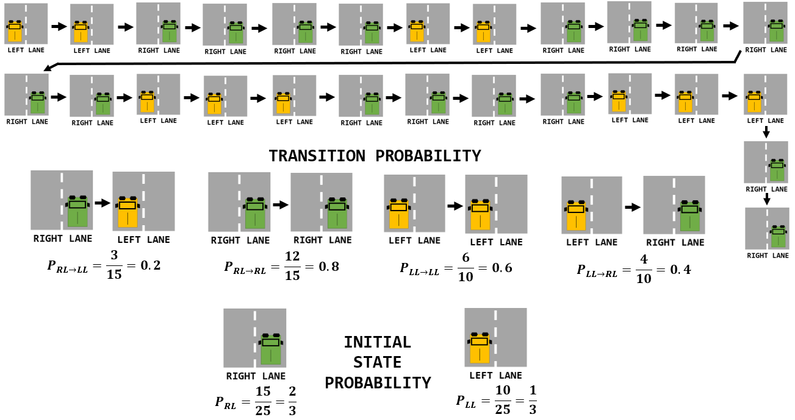
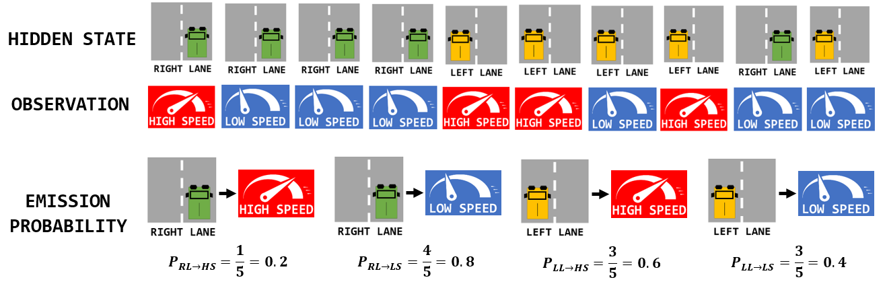

# hmm_for_autonomous_driving

# Introduction
Disclaimer:

- The goal of this repository is to get more familiar with the concepts of **`Hidden Markov Models`** (**= HMM**).
- The scope of ambition is therefore limited and the examples are very simple, only serving educational purposes.

Addressed topics:
- Problem setting: use a basic example to introduce the **terminology**.
- implementation of the **Viterbi Algorithm** for training Hidden Markov Models.
- implementation of the **Baum–Welch Algorithm** to find the maximum likelihood estimate of the parameters of the HMM.

# Problem motivation
For left-hand-drive countries such as the UK, just invert the reasoning :smiley:

- Your car is driving on a **2-lane highway**.
- imagine that you can **remotely monitor the velocity of the car (I communicate it to you)**
- but you do have **no direct access to the lateral position** (`right lane` of `left lane`).
- how could you deduce the `lane` based on the single information we receive: the `speed`?

#### Emission probability

If I am telling you that I am driving with a `low speed`, you **may deduce** that I am on the right lane.
- For instance, because I am just driving alone at a reasonable pace
- or because I am blocked by a slow vehicle.
- But I could also drive fast on this `right lane` *(have you ever been driving alone on a German highway?)*

Similarly, if you get informed of a `high speed`, you could say that I am **more likely** to be driving on the left lane.
- Probably overtaking another vehicle.
- Nevertheless, this is **not always true**: think of the situation where you are waiting on the left lane behind a truck trying to overtake another truck

We get a **first intuition**:
- the variable `lane` seems to have an impact on the variable `speed`.
- in  other words: *a priori* **you do not drive at the same pace depending if you are one the `left lane` or the `right lane`**.
- But the relation is **not deterministic**, rather **stochastic**.

This finding will be modelled using **`emission probabilities`** in the following.

#### Transition probability

You could have another intuition:
- human drivers usually **stay on their lanes**.
- Hence if you are on `right lane` at time `t`, you are likely to still be on `right lane` at time `t+1`.
- Again, this **does not always hold** and you can find **exception**.
- but here comes a second intuition: *a priori* **the `lane` at time `t` is influenced by the `lane` at time `t-1`**.

The concept of **`transition probability`** will be used to model this second remark.

### Terminology

|   | 
|:--:| 
| *The speed is the `observation` while the lane constitutes the `hidden state`. Some examples show that all `emissions` are possible* |


### objective

We want to **infer the lane** (`right` of `left`) of the car (= **hidden state**) based on a **sequence of speed measurements** (= **observation**)

### assumptions
To keep the problem as simple as possible:
- let's **discretize the speed** into `low speed` and `high speed`.
- time steps are discretized.
- lane transitions are ignored: either you are on `left lane` or you are on `right lane`

A word about the Markov Property:
- we just said that it is useful to know the present `lane` (at time `t`) to infer the future `lane` (at time `t+1`)
- what about the previous `lane` at `t-1`? It probably also hold relevant information?
- here is a strong assumption about inferring in this stochastic process:
	- the conditional probability distribution of **future states** of the process (conditional on both past and present states) **depends only upon the present state**, not on the sequence of events that preceded it.
- in other words, **"the future is independant of the past given the present"**
- this strong assumption is known as the **Markov Property** (also named **"memoryless property"**) and will make computations easier in the following.

# Problem formulation

- **Hidden state**: discrete random variable `lane` in {`Right Lane`, `Left Lane`}
- **Observation**: discrete random variable `speed` in {`Low Speed`, `High Speed`}
- **Emission probability**: `P[speed(t) given lane(t)]`
- **Transition probability**: `P[lane(t+1) given lane(t)]`
- **Prior probability**: `P[lane(t)]`
- **Marginal probability**: `P[speed(t)]`
- **Posterior probability**: `P[lane(t) given speed(t)]`


# Questions:
- [Q1](#q1) - how to **derive the probability models**?
- [Q2](#q2) - if you receive a **single observation**, what are the probability for the car to be in each lane?
- [Q3](#q3) - if you receive the **larger sequence of observations** [`high speed`, `high speed`, `low speed`, `high speed`], what is the most probable sequence of lane states?
- [Q4](#q4) - what if you are **not directly given the probability models**?

# Answers

## Q1

Let assume we are given some data: a sequence of observations and states.
- Here are only a few for simplicity but you could imagine longer recordings.
- You can think of it as some **samples** of the underlying **joint distributions**.

The idea is to **approximate the model parameters by counting the occurrences**.

### Transition probability

**Counting the number** of transitions gives a likelihoods we can used for our **transition probability** model.
- For instance, we made 15 transitions starting from `right lane` and among them 2 ended in `left lane`.
	- Hence the P[`right lane` -> `left lane`] = 
- Since probabilities must sum to one (normalization), or just by counting for the other case (`right lane` is followed 10 times by a `right lane`)
	- P[`right lane` -> `right lane`] = 

|   | 
|:--:| 
| *Derivation of the transition probability model* |

### Emission probability

Counting can also be used to determine the **emission probability** model.
- For instance, how many times a `left lane` has caused a `high speed`?
- Note: in the **Bayesian framework**, we will see that it corresponds to the **Likelihood**.

|   | 
|:--:| 
| *Derivation of the emission probability model* |

## Prior probability

At any time `t`, what is your guess on the distribution of the hidden state if no information is given?
- Nothing about previous state and nothing about the observation)

Two options are available:
- either you count occurrences
- or you use the transition model and the fact that probabilities sum to `1`:
	- ```p[`left lane`, t] = 0.8 * p[`left lane`, t-1] + 0.2 * p[`right lane`, t-1]```
	- ```p[`right lane`, t] = 1 - p[`left lane`, t]```
	
### Summary

| , `transition probability` model (middle), and the `transition probability` model (below)")  | 
|:--:| 
| *Hidden Markov Model with the `prior probability` model (up), `transition probability` model (middle), and the `transition probability` model (below)* |

## Q2

### Prior

Before any observation we know that `right lane` appears `2/3` of the time and `left lane` `1/3`.
- These probabilities would have been the answers if we were to **ignore the observation**.
- This distribution (called `prior`) must be **updated** when considering the observation.
- The `prior` is converted to a `posterior` using `likelihood` as `observations` are considered.

### Likelihood

Based on supplied data, we found that on the left lane it is more likely to drive fast. And slow on the right lane.
- This led to `emission probability`, also understood as `likelihood`: **given a state**, what is the probability for each observation.
- In the `posterior`, it is the **opposite** that apply: **given an observation**, what is the probability for each state?

### Marginal
The Bayes Rule states that `Posterior` = `Normalized (prior * likelihood)`
- The normalization is done using the `Marginal Probabilities`
- Under all possible hypothesese, how probable is each `speed`?
- Using the **law of total probability**:
	- P(`high speed`) = P(`high speed` given `left lane`) `*` P(`left lane`) + P(`high speed` given `right lane`) `*` P(`right lane`)
	- P(`low speed`) = P(`low speed` given `left lane`) `*` P(`left lane`) + P(`low speed` given `right lane`) `*` P(`right lane`)
- Eventually:
	- P(`high speed`) = 
	- P(`low speed`) = 

### Bayes Rule
Let's use Bayesian Statistics to recap:
	- P(`lane` given `speed`) = P(`lane`) `*` P(`speed` given `lane`) / P(`speed`)
	- `Posterior` = `Prior` `*` `Likelihood` / `Marginal`
- For instance
	- P(`left lane` given `high speed`) = P(`left lane`) `*` P(`high speed` given `left lane`) / P(`high speed`)

Priors:
	- P(`right lane`) = `2/3`
	- P(`left lane`) = `1/3`

Marginals:
	- P(`high speed`) = `2/3`
	- P(`low speed`) = `1/3`

Likelihoods:
	- P(`high speed` given `left lane`) = `2/3`
	- P(`high speed` given `right lane`) = `2/3`
	- P(`low speed` given `left lane`) = `2/3`
	- P(`low speed` given `right lane`) = `2/3`

### Summary

The question was *given an observation, what is the most likely hidden state?*.
Well, just looking at the numbers on the figure below and taking the `max`, the answer is:

- Given `high speed` is observed, the most likely state is `left lane`
- Given `low speed` is observed, the most likely state is `right lane`

It is close to our intuition.

|   | 
|:--:| 
| *Derivation of the posterior probabilities for a single observation* |

## Q3

The previous observation had `size=1`
- For each observation we have computed the two posterior probabilities and **select the maximum one**.
- A **similar approach** can be used for larger sequences of observation.

But an issue appears:
| Size of the `observation` sequence | number of terms to compute before applying `max` |
| :---:        |     :---:      |
| 1   | 4     |
| 2     | 8       |
| 3     | 16       |
| ...     | ...       |
| 10     | 1600       |

### Dynamic Programming

Assume that after the second observation, the sub-sequence (`left lane`, `right lane`) is found to be more likely that the sub-sequence (`right lane`, `right lane`).
- Is it **worth carry on some investigation** in the branch (`left lane`, `right lane`)?
- Do not forget that the only goal is to **find the most likely sequence (and nothing else)!**
- Whatever you append to (`left lane`, `right lane`), the resulting sequence will be less likely than appending the same to (`right lane`, `right lane`).

This example show the intuition of `Dynamic Programming`:
- compute local blocks and consider only the most promising ones to build the next ones.

# Further work
Ideas to go further:
- route is the hidden variable

# Acknowledgement and references
I took some inspiration of this [video](https://www.youtube.com/watch?v=kqSzLo9fenk) by Luis Serrano.
